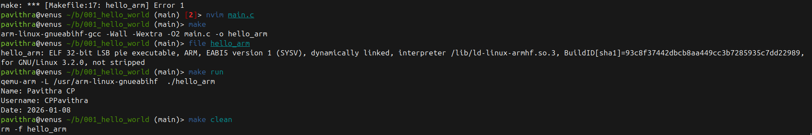

## Project 01: ARM Cross-Compilation & QEMU Setup- HELLO WORLD

**Goal:** Verify the toolchain setup by cross-compiling a C application for ARMv7 (BeagleBone architecture) and executing it on an x86 host using QEMU user-mode emulation.

Note: I automated the build steps because typing long cross-compiler flags manually is error-prone. Using a Makefile ensures that anyone cloning this repo can build it instantly with a single command, a practice I will continue for all my GSoC submissions.

### Tools Used
* **Compiler:** `arm-linux-gnueabihf-gcc` (Target: ARM 32-bit Hard Float)
* **Emulator:** `qemu-user` (User-space emulation)
* **Build System:** GNU Make

### Execution Output
Successfully compiled and ran the binary. The `file` command confirms the ARM architecture, and QEMU successfully executes the logic.



### Build Instructions
To replicate this test:

```bash
make
file hello_arm
make run
make clean
