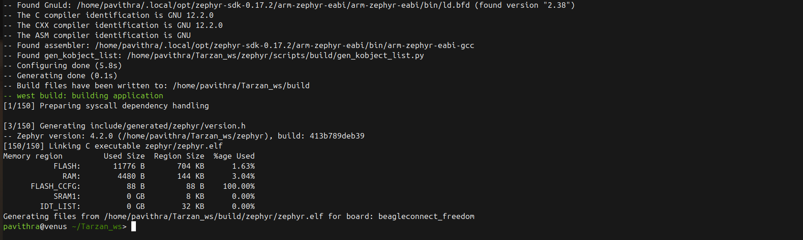
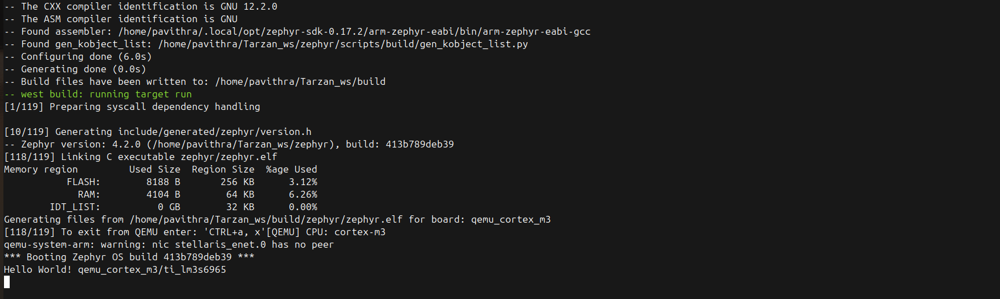

# 02. Zephyr RTOS & BeagleBoard Integration (BEAGLECONNECT_FREEDOM BOARD)

NOTE-I validated the build for the BeagleConnect Freedom target and verified the application logic using Cortex-M3 emulation. 
**MEANING**: I can compile the code for THE REAL BOARD. **AND ALSO** I can run it on the CHIP ARCHITECTURE.
However I believe, the first part is what is vital.

**Goal:** Extend an existing Zephyr RTOS workspace to support BeagleBoard hardware (TI CC1352) by integrating the required HAL modules and verifying the build via QEMU.
This existing Zephyr RTOS workspace is shared with my previous (Tarzan) project for improving embedded drive of Martian Rovers.

**Validation Strategy:**
Since full board emulation is not available for `beagleconnect_freedom` in QEMU, I adopted a hybrid validation approach:
1.  **Build Validation:** Compiled for the **Real Board** target to verify the toolchain and HAL integration.
2.  **Logic Validation:** Executed the application kernel on **Cortex-M3 QEMU** to verify runtime logic.

### Configuration Steps
1.  **Workspace Adaptation:** Leveraged Zephyr v4.2.0 environment.
2.  **Dependency Resolution:** Modified the `west` manifest to explicitly pull the **Texas Instruments HAL (`hal_ti`)**.
    * *Challenge:* The default manifest excludes TI drivers to save space, causing build failures.
    * *Fix:* Manually updated `west.yml` to enable the `hal_ti` group filter.
3.  **Target Validation:**
    * **Command:** `west build -b beagleconnect_freedom zephyr/samples/basic/blinky`

### Proof of Build (BeagleConnect Freedom)

### Proof of Simulation (QEMU)

